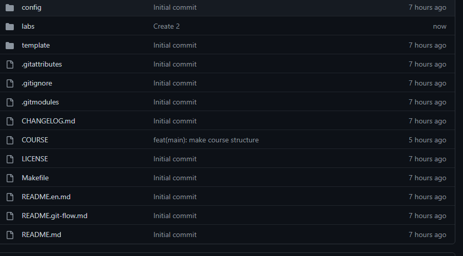
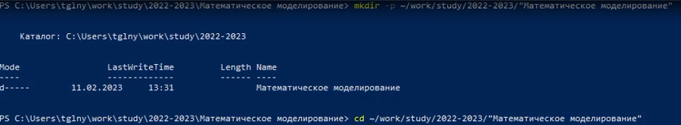
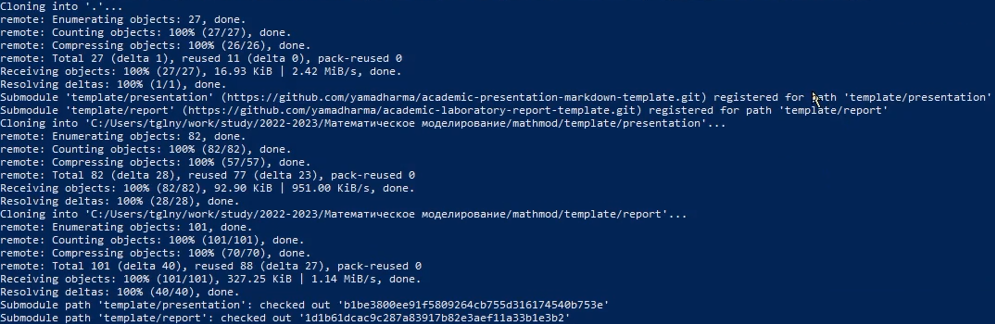
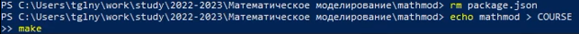
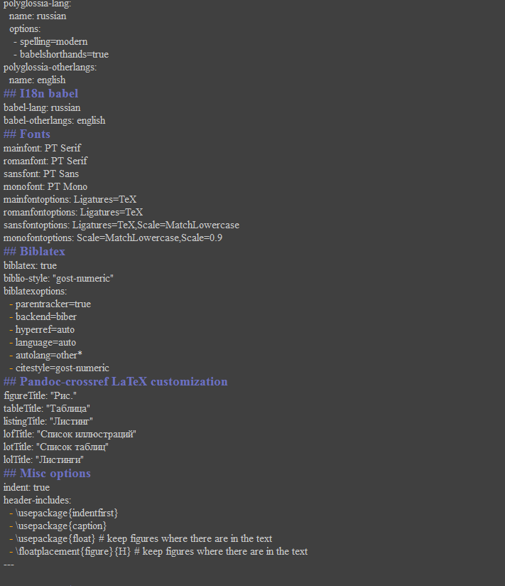

---
## Front matter
lang: ru-RU
title: Презентация лабораторной работы №1
subtitle: Математическое моделирование
author:
  - Вишняков А.
institute:
  - Российский университет дружбы народов, Москва, Россия
date: 11 февраля 2023

## i18n babel
babel-lang: russian
babel-otherlangs: english

## Formatting pdf
toc: false
toc-title: Содержание
slide_level: 2
aspectratio: 169
section-titles: true
theme: metropolis
header-includes:
 - \metroset{progressbar=frametitle,sectionpage=progressbar,numbering=fraction}
 - '\makeatletter'
 - '\beamer@ignorenonframefalse'
 - '\makeatother'
---

# Информация

## Докладчик

  * Вишняков Александр
  * группа НКНбд-01-20
  * Факультет физико-математических и естественных наук
  * Российский университет дружбы народов
  * [GitHub](https://github.com/sanchess02)

## Цели и задачи

- Создать шаблон репозитория для выполнения лабораторных работ
- Освежить и дополнить навыки владения git, Markdown, командной строкой

## Материалы и методы

- Процессор `pandoc` для входного формата Markdown
- Результирующие форматы
	- `pdf`
	- `html`
- Автоматизация процесса создания: `Makefile`
- Технология git

# Выполнение лабораторной работы

1. Для начало мы создали удаленный репозиторий из шаблона

- Репозиторий: <https://github.com/adil-cpu/mathmod>

2. Дальше мы создаем каталог и клонируем удаленный репозиторий используя командную строку

## Настройка необходимой иерархии

- Используя командную строку и команду `make` настроили необходимую иерархию

## Написание отчета

- Используя Markdown и vim написали отчет о проделанной работе

# Результаты

Настроили все необходимые каталоги и репозитории для успешного выполнения последующих лабораторных работ.
