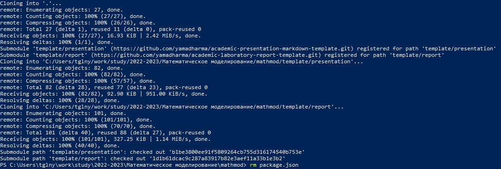
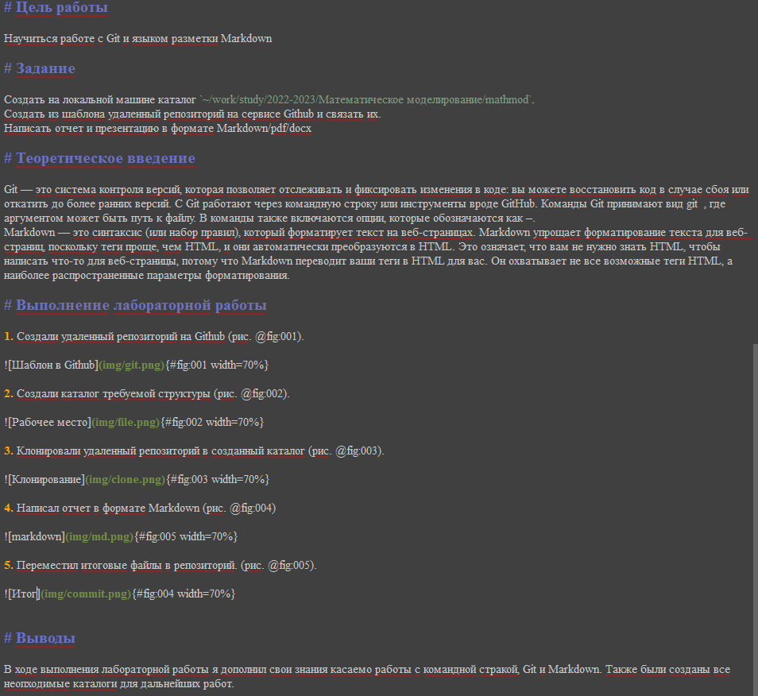
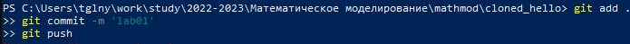

---
## Front matter
title: "Шаблон отчёта по лабораторной работе"
subtitle: "Простейший вариант"
author: "Вишняков Александр"

## Generic otions
lang: ru-RU
toc-title: "Содержание"

## Bibliography
bibliography: bib/cite.bib
csl: pandoc/csl/gost-r-7-0-5-2008-numeric.csl

## Pdf output format
toc: true # Table of contents
toc-depth: 2
lof: true # List of figures
lot: true # List of tables
fontsize: 12pt
linestretch: 1.5
papersize: a4
documentclass: scrreprt
## I18n polyglossia
polyglossia-lang:
  name: russian
  options:
	- spelling=modern
	- babelshorthands=true
polyglossia-otherlangs:
  name: english
## I18n babel
babel-lang: russian
babel-otherlangs: english
## Fonts
mainfont: PT Serif
romanfont: PT Serif
sansfont: PT Sans
monofont: PT Mono
mainfontoptions: Ligatures=TeX
romanfontoptions: Ligatures=TeX
sansfontoptions: Ligatures=TeX,Scale=MatchLowercase
monofontoptions: Scale=MatchLowercase,Scale=0.9
## Biblatex
biblatex: true
biblio-style: "gost-numeric"
biblatexoptions:
  - parentracker=true
  - backend=biber
  - hyperref=auto
  - language=auto
  - autolang=other*
  - citestyle=gost-numeric
## Pandoc-crossref LaTeX customization
figureTitle: "Рис."
tableTitle: "Таблица"
listingTitle: "Листинг"
lofTitle: "Список иллюстраций"
lotTitle: "Список таблиц"
lolTitle: "Листинги"
## Misc options
indent: true
header-includes:
  - \usepackage{indentfirst}
  - \usepackage{caption}
  - \usepackage{float} # keep figures where there are in the text
  - \floatplacement{figure}{H} # keep figures where there are in the text
---

# Цель работы

Научиться работе с Git и языком разметки Markdown

# Задание

Создать на локальной машине каталог `~/work/study/2022-2023/Математическое моделирование/mathmod`. 
Создать из шаблона удаленный репозиторий на сервисе Github и связать их.
Написать отчет и презентацию в формате Markdown/pdf/docx

# Теоретическое введение

Git — это система контроля версий, которая позволяет отслеживать и фиксировать изменения в коде: вы можете восстановить код в случае сбоя или откатить до более ранних версий. С Git работают через командную строку или инструменты вроде GitHub. Команды Git принимают вид git  , где аргументом может быть путь к файлу.
Markdown — это синтаксис (или набор правил), который форматирует текст на веб-страницах. Markdown упрощает форматирование текста для веб-страниц, поскольку теги проще, чем HTML, и они автоматически преобразуются в HTML. Это означает, что вам не нужно знать HTML, чтобы написать что-то для веб-страницы, потому что Markdown переводит ваши теги в HTML для вас. Он охватывает не все возможные теги HTML, а наиболее распространенные параметры форматирования.

# Выполнение лабораторной работы

1. Создали удаленный репозиторий на Github (рис. @fig:001).

2. Создали каталог требуемой структуры (рис. @fig:002).

3. Клонировали удаленный репозиторий в созданный каталог (рис. @fig:003).

4. Написал отчет в формате Markdown (рис. @fig:004)

5. Переместил итоговые файлы в репозиторий. (рис. @fig:005).

{#fig:004 width=70%}

# Выводы

В ходе выполнения лабораторной работы я дополнил свои знания касаемо работы с командной стракой, Git и Markdown. Также были созданы все неопходимые каталоги для дальнейших работ.

