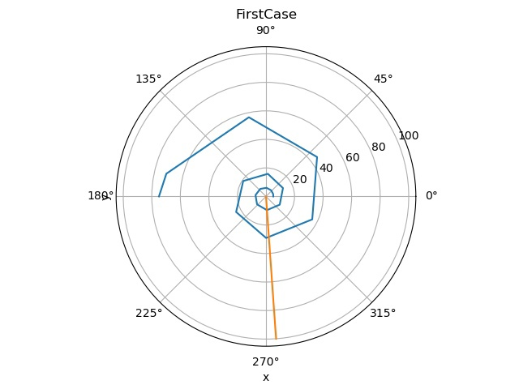

---
## Front matter
lang: ru-RU
title: Лабораторная работа №2
subtitle: Задача о погоне
author:
  - Вишняков А.
institute:
  - Российский университет дружбы народов, Москва, Россия
date: 9 апреля 2024

## i18n babel
babel-lang: russian
babel-otherlangs: english

## Formatting pdf
toc: false
toc-title: Содержание
slide_level: 2
aspectratio: 169
section-titles: true
theme: metropolis
header-includes:
 - \metroset{progressbar=frametitle,sectionpage=progressbar,numbering=fraction}
 - '\makeatletter'
 - '\beamer@ignorenonframefalse'
 - '\makeatother'
 - \usepackage{amsmath}
---

# Информация

## Докладчик

  * Вишняков Александр
  * студент группы НКНбд-01-21
  * Факультет физико-математических и естественных наук
  * Российский университет дружбы народов
  * [GitHub](https://github.com/sanchess02)

# Вводная часть

## Актуальность

 - Решение задачи о погоне позволяет определить наилучшую траекторию для перехвата.
 - Таким образом повышаются навыки владения языком программирования Julia.

## Объект и предмет исследования

- Задача о погоне
- Язык программирования Julia

## Цели и задачи

- Решить задачу о погоне с определенными входными данными
- Овладеть языком программирования Julia
- Построить график траектории движения катера в полярных координатах

# Содержание лабораторной работы

## Постановка задачи

На море в тумане катер береговой охраны преследует лодку браконьеров. Через определенный промежуток времени туман рассеивается, и лодка обнаруживается на расстоянии 6,3 км от катера. Затем лодка снова скрывается в тумане и уходит прямолинейно в неизвестном направлении. Известно, что скорость катера в 2,3 раза больше скорости браконьерской лодки.
1. Запишите уравнение, описывающее движение катера, с начальными условиями для двух случаев (в зависимости от расположения катера относительно лодки в начальный момент времени).
2. Постройте траекторию движения катера и лодки для двух случаев.
3. Найдите точку пересечения траектории катера и лодки3. 

## Решение задачи и формулы.

Первый случай:
θ = 0

X1/v = (k - x) / N * v → x1 = k/(N+1) → x1 = 6.3/3.3 = 1.909

Второй случай:
θ = -π

X2/v = (k - x2) / N * v → x2 = k/(N-1) → x2 = 6.3/1.3 = 4.846

Vt = sqrt((N*v)^2 - v^2) = sqrt(N^2 - 1)*v = sqrt(4.29) * v → dr/dθ = r/sqrt(4.2

# Решение программными средствами

## Подключение библиотек и код решения задачи

Установка библиотек:
- import Pkg; Pkg.add("PyPlot")
- import Pkg; Pkg.add("DifferentialEquations")

Код для 1 случая:
```julia
using DifferentialEquations;
using PyPlot;

const x1 = 6.3/3.3
const x2 = 6.3/1.3
const T = (0, 5pi)

function myfunction(u, p, T)
return u/sqrt(4.29)
end

q1  = ODEProblem(myfunction, x1, T)
q2 = ODEProblem(myfunction, x2, T)

s1 = solve(q1,
 abstol=1e-8, 
 reltol=1e-8)
s2 = solve(q2,
 abstol=1e-8,
  reltol=1e-8);

polar(s1.t, s1.u + fill(x1, 20))

polar(fill(-1.5, 11), collect(0: 10: 50))


polar(s2.t, s2.u + fill(x2, 32))
title("FirstCase")
xlabel("x")

polar(fill(-1.5, 11), collect(0: 10: 100))
ylabel("y")

savefig("First_pic.jpg")

```

## Вывод графика для первого случая

Код для 2 случая:
```julia
using DifferentialEquations;
using PyPlot;

const x1 = 6.3/3.3
const x2 = 6.3/1.3
const T = (-pi, 5pi)

function myfunction(u, p, T)
return u/sqrt(4.29)
end

q1  = ODEProblem(myfunction, x1, T)
q2 = ODEProblem(myfunction, x2, T)

s1 = solve(q1,
 abstol=1e-8, 
 reltol=1e-8)
s2 = solve(q2,
 abstol=1e-8,
  reltol=1e-8);

polar(s1.t, s1.u + fill(x1, 20))

polar(fill(-1.5, 11), collect(0: 10: 50))


polar(s2.t, s2.u + fill(x2, 32))
title("SecondCase")
xlabel("x")

polar(fill(-1.5, 11), collect(0: 10: 100))
ylabel("y")

savefig("Second_pic.jpg")

```


# Результаты

## Траектория катера в первом случае




## Траектория катера во втором случае


## Вывод

В моем случае ответы 1 и 2 вариантов решений(когда θ = 0 и θ = -π) вышли одинаковыми. Так же научился решать подобные задачи на языке программирования Julia.

