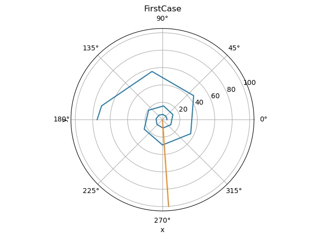
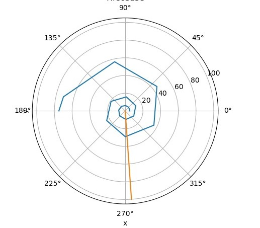

---
## Front matter
title: "Отчет по лабораторной работе"
subtitle: "Лабораторная работа №2"
author: "Вишняков Александр"

## Generic otions
lang: ru-RU
toc-title: "Содержание"

## Bibliography
bibliography: bib/cite.bib
csl: pandoc/csl/gost-r-7-0-5-2008-numeric.csl

## Pdf output format
toc: true # Table of contents
toc-depth: 2
lof: true # List of figures
lot: true # List of tables
fontsize: 12pt
linestretch: 1.5
papersize: a4
documentclass: scrreprt
## I18n polyglossia
polyglossia-lang:
  name: russian
  options:
  - spelling=modern
  - babelshorthands=true
polyglossia-otherlangs:
  name: english
## I18n babel
babel-lang: russian
babel-otherlangs: english
## Fonts
mainfont: PT Serif
romanfont: PT Serif
sansfont: PT Sans
monofont: PT Mono
mainfontoptions: Ligatures=TeX
romanfontoptions: Ligatures=TeX
sansfontoptions: Ligatures=TeX,Scale=MatchLowercase
monofontoptions: Scale=MatchLowercase,Scale=0.9
## Biblatex
biblatex: true
biblio-style: "gost-numeric"
biblatexoptions:
  - parentracker=true
  - backend=biber
  - hyperref=auto
  - language=auto
  - autolang=other*
  - citestyle=gost-numeric
## Pandoc-crossref LaTeX customization
figureTitle: "Рис."
tableTitle: "Таблица"
listingTitle: "Листинг"
lofTitle: "Список иллюстраций"
lotTitle: "Список таблиц"
lolTitle: "Листинги"
## Misc options
indent: true
header-includes:
  - \usepackage{indentfirst}
  - \usepackage{float} # keep figures where there are in the text
  - \usepackage{mathtools}
  - \usepackage{amsmath}
  - \floatplacement{figure}{H} # keep figures where there are in the text
---

# Цель работы

Изучить основы языка программирования Julia, решив математическую задачу о погоне.


# Задание

На море в тумане катер береговой охраны преследует лодку браконьеров. Через определенный промежуток времени туман рассеивается, и лодка обнаруживается на расстоянии 6,3 км от катера. Затем лодка снова скрывается в тумане и уходит прямолинейно в неизвестном направлении. Известно, что скорость катера в 2,3 раза больше скорости браконьерской лодки.
1. Запишите уравнение, описывающее движение катера, с начальными условиями для двух случаев (в зависимости от расположения катера относительно лодки в начальный момент времени).
2. Постройте траекторию движения катера и лодки для двух случаев.
3. Найдите точку пересечения траектории катера и лодки

# Теоретическое введение

***Julia*** — высокоуровневый высокопроизводительный свободный язык программирования с динамической типизацией, созданный для математических вычислений. Эффективен также и для написания программ общего назначения. Синтаксис языка схож с синтаксисом других математических языков (например, MATLAB и Octave), однако имеет некоторые существенные отличия. Julia написан на Си, C++ и Scheme. Имеет встроенную поддержку многопоточности и распределённых вычислений, реализованные в том числе в стандартных конструкциях.


***OpenModelica*** — свободное открытое программное обеспечение для мо- делирования, симуляции, оптимизации и анализа сложных динамических систем. Основано на языке Modelica. Активно развивается Open Source Modelica Consortium, некоммерческой неправительственной организацией. Open Source Modelica Consortium является совместным проектом RISE SICS East AB и Линчёпингского университета. По своим возможностям приближается к таким вычислительным средам как Matlab Simulink, Scilab xCos, имея при этом значительно более удобное представление системы уравнений исследуемого блока.

# Выполнение лабораторной работы

## Формулы, которым я воспользовался

Первый случай:
θ = 0

X1/v = (k - x) / N * v → x1 = k/(N+1) → x1 = 6.3/3.3 = 1.909

Второй случай:
θ = -π

X2/v = (k - x2) / N * v → x2 = k/(N-1) → x2 = 6.3/1.3 = 4.846

Vt = sqrt((N*v)^2 - v^2) = sqrt(N^2 - 1)*v = sqrt(4.29) * v → dr/dθ = r/sqrt(4.29)


## Решение программными средствами

Для начала скачиваю пакеты библиотек DifferentialEquations и Plots командами "import Pkg; Pkg.add("PyPlot")" и "import Pkg; Pkg.add("DifferentialEquations")".

Код на Julia:

```julia
using DifferentialEquations;
using PyPlot;

const x1 = 6.3/3.3
const x2 = 6.3/1.3
const T = (0, 5pi)

function myfunction(u, p, T)
return u/sqrt(4.29)
end

q1  = ODEProblem(myfunction, x1, T)
q2 = ODEProblem(myfunction, x2, T)

s1 = solve(q1,
 abstol=1e-8, 
 reltol=1e-8)
s2 = solve(q2,
 abstol=1e-8,
  reltol=1e-8);

polar(s1.t, s1.u + fill(x1, 20))

polar(fill(-1.5, 11), collect(0: 10: 50))


polar(s2.t, s2.u + fill(x2, 32))
title("FirstCase")
xlabel("x")

polar(fill(-1.5, 11), collect(0: 10: 100))
ylabel("y")

savefig("First_pic.jpg")

```





# Вывод

В моем случае ответы 1 и 2 вариантов решений(когда θ = 0 и θ = -π) вышли одинаковыми. Так же научился решать подобные задачи на языке программирования Julia.