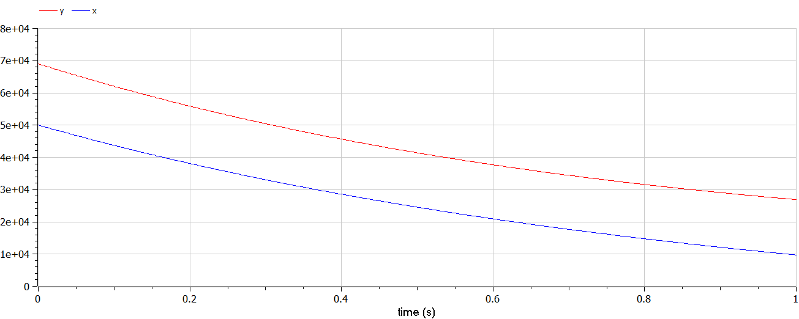
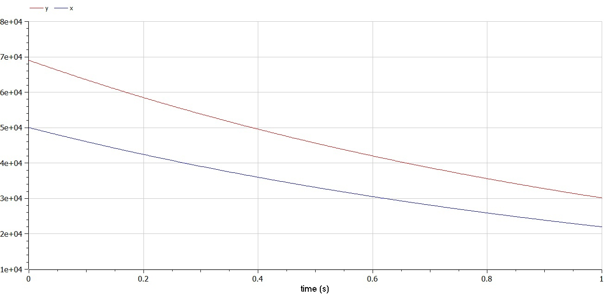
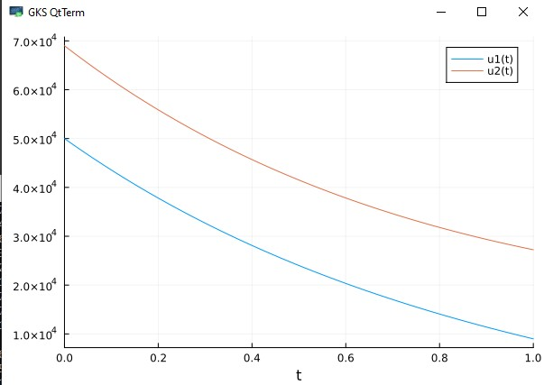
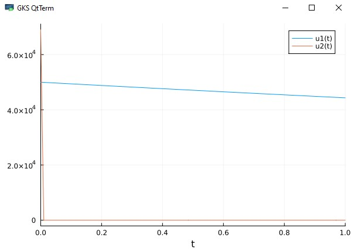

---
## Front matter
title: "Отчет по лабораторной работе"
subtitle: "Лабораторная работа №3"
author: "Вишняков Александр"

## Generic otions
lang: ru-RU
toc-title: "Содержание"

## Bibliography
bibliography: bib/cite.bib
csl: pandoc/csl/gost-r-7-0-5-2008-numeric.csl

## Pdf output format
toc: true # Table of contents
toc-depth: 2
lof: true # List of figures
lot: true # List of tables
fontsize: 12pt
linestretch: 1.5
papersize: a4
documentclass: scrreprt
## I18n polyglossia
polyglossia-lang:
  name: russian
  options:
  - spelling=modern
  - babelshorthands=true
polyglossia-otherlangs:
  name: english
## I18n babel
babel-lang: russian
babel-otherlangs: english
## Fonts
mainfont: PT Serif
romanfont: PT Serif
sansfont: PT Sans
monofont: PT Mono
mainfontoptions: Ligatures=TeX
romanfontoptions: Ligatures=TeX
sansfontoptions: Ligatures=TeX,Scale=MatchLowercase
monofontoptions: Scale=MatchLowercase,Scale=0.9
## Biblatex
biblatex: true
biblio-style: "gost-numeric"
biblatexoptions:
  - parentracker=true
  - backend=biber
  - hyperref=auto
  - language=auto
  - autolang=other*
  - citestyle=gost-numeric
## Pandoc-crossref LaTeX customization
figureTitle: "Рис."
tableTitle: "Таблица"
listingTitle: "Листинг"
lofTitle: "Список иллюстраций"
lotTitle: "Список таблиц"
lolTitle: "Листинги"
## Misc options
indent: true
header-includes:
  - \usepackage{indentfirst}
  - \usepackage{float} # keep figures where there are in the text
  - \usepackage{mathtools}
  - \usepackage{amsmath}
  - \floatplacement{figure}{H} # keep figures where there are in the text
---


# Цель работы                                                                                                 

Рассмотреть простейшую модель боевых действий – модель Ланчестера.

# Теоретическая справка

Модель Ланчестера. В противоборстве могут принимать участие как регулярные войска, так и партизанские отряды. В общем случае главной характеристикой соперников являются численности сторон. Если в какой-то момент времени одна из численностей обращается в нуль, то данная сторона считается проигравшей (при условии, что численность другой стороны в данный момент положительна).

В этой работе ассмотри два случая ведения боевых действий: 

1. Боевые действия между регулярными войсками. 

2.  Боевые действия с участием регулярных войск и партизанских отрядов. 


# Выполнение работы 
## 6 вариант

Между страной Х и страной У идет война. Численность состава войск исчисляется от начала войны, и являются временными функциями x(t) и y(t) . В начальный момент времени страна Х имеет армию численностью 50 000 человек, а в распоряжении страны У армия численностью в 69 000 человек. Для упрощения модели считаем, что коэффициенты a, b, c, h постоянны. Также считаем P(t) и Q(t) непрерывные функции. Постройте графики изменения численности войск армии Х и армии У для следующих случаев:

1. Модель боевых действий между регулярными войсками

   dx/dt = -0,34x(t)-0,72y(t)+sin(t+10)
   
   dy/dt = -0,89x(t)-0,43y(t)+cos(t+20)
   
2. Модель ведение боевых действий с участием регулярных войск и партизанских отрядов 

    dx/dt = -0,12x(t)-0,51y(t)+sin(20t)
   
   dy/dt = -0,3x(t)y(t)-0,61y(t)+cos(13t)


   В первом случае численность регулярных войск определяется тремя факторами: 

   скорость уменьшения численности войск из-за причин, не связанных с боевыми действиями (болезни, травмы, дезертирство); 

   скорость потерь, обусловленных боевыми действиями противоборствующих сторон (что связанно с качеством стратегии, уровнем вооружения, профессионализмом солдат и т.п.); 

   скорость поступления подкрепления (задаётся некоторой функцией от времени). 

   

В этом случае модель боевых действий между регулярными войсками описывается следующим образом

   dx/dt = -a(t)x(t)-b(t)y(t)+P(t)
   
   dy/dt = -c(t)x(t)-h(t)y(t)+Q(t)

Потери, не связанные с боевыми действиями, описывают члены -a(t)x(t) и -h(t)y(t) , члены -b(t)y(t) и -c(t)x(t) отражают потери на поле боя. Коэффициенты b(t) и c(t) указывают на эффективность боевых действий со стороны у и х соответственно, a(t), h(t) - величины, характеризующие степень влияния различных факторов на потери. Функции P(t), Q(t) учитывают  возможность подхода подкрепления к войскам Х и У в течение одного дня.

Во втором случае в борьбу добавляются партизанские отряды. Нерегулярные войска в отличии от постоянной армии менее уязвимы, так как действуют скрытно, в этом случае сопернику приходится действовать неизбирательно, по площадям, занимаемым партизанами. Поэтому считается, что тем потерь партизан, проводящих свои операции в разных местах на некоторой известной территории, пропорционален не только численности армейских соединений, но и численности самих партизан. В результате модель принимает вид (в этой системе все величины имею тот же смысл):

   dx/dt = -a(t)x(t)-b(t)y(t)+P(t)

   dy/dt = -c(t)x(t)y(t)-h(t)y(t)+Q(t)


**1 случай на *OpenModelica***

```
model lab3
parameter Real a=0.34 ;// Константа, характеризующая степень влияния различных факторов на потери
parameter Real b=0.72; // Эффективность боевых действий для армии y
parameter Real c=0.89; // Эффективность боевых действий для армии x
parameter Real h=0.43; // Константа, характеризующая степень влияния различных факторов на потери

Real x;
Real y;

initial equation  
  x=50000; // Численность армии в X
  y=69000; // Численность армии в Y

equation

  der(x)= -a*x - b*y + sin(10*time);  // Возможность подхода подкрепления к войскам X
  der(y)= -c*x - h*y + cos(20*time);  // Возможность подхода подкрепления к войскам Y
  
end lab3;

```

Получили график для первого случая (рис.1):



**2 случай на *OpenModelica***

```
model lab3
parameter Real a=0.12;
parameter Real b=0.51;
parameter Real c=0.3;
parameter Real h=0.61;

Real x;
Real y;

initial equation  
  x=50000;
  y=69000;

equation

  der(x)= -a*x - b*y + sin(20*time);
  der(y)= -c*x - h*y + cos(13*time);
end lab3;
```

Получили график для второго случая (рис.2):



**2 случая на *Julia***
```
using Plots
using DifferentialEquations
x0 = 50000
y0 = 69000
t0 = 0
tmax =0,001

a=0.37;
b= 0.72;
c=0.89;
h=0.43;

a2=0.12;
b2= 0.51;
c2=0.3;
h2=0.61;
function P(t)
return sin(10*t)
end
function Q(t)
return cos(20*t)
end
function P2(t)
return sin(20*t)
end
function Q2(t)
return cos(13*t)
end

function syst(dy, y, p, t)
dy[1] = -a*y[1] - b*y[2] + P(t)
dy[2] = -c*y[1] - h*y[2] + Q(t)
end
function syst2(dy, y, p, t)
dy[1] = -a2*y[1] - b2*y[2] + P2(t)
dy[2] = -c2*y[1]*y[2] - h2*y[2] + Q2(t)
end
u0 = [x0; y0]
tspan = (t0, tmax)
t = collect(LinRange(0, 1, 100))
prob = ODEProblem(syst, u0, tspan)
sol = solve(prob, saveat=t)
prob2 = ODEProblem(syst2, u0, tspan)
sol2 = solve(prob2, saveat=t)
plot(sol)
plot(sol2)

```
Получили график для первого случая (рис.3):



Получили график для второго случая (рис.4):


# Вывод

В ходе выполнения лабораторной работы я рассмотрел и построил простейшую модель боевых действий – модель Ланчестера.