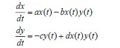
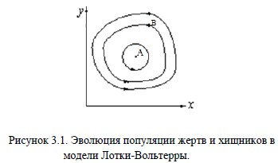
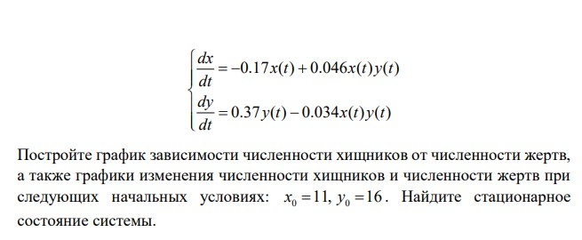
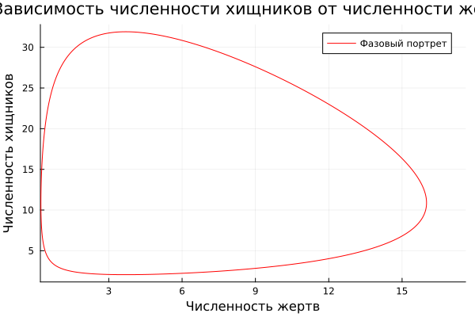
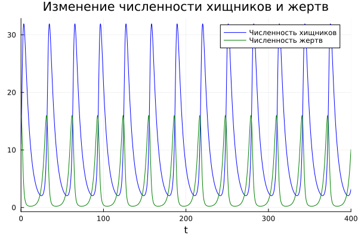

---
## Front matter
lang: ru-RU
title: Лабораторная работа №5
subtitle: Математическое моделирование
author:
  - Вишняков Алексанр.
institute:
  - Российский университет дружбы народов, Москва, Россия
date: 12 апреля 2024

## i18n babel
babel-lang: russian
babel-otherlangs: english

## Formatting pdf
toc: false
toc-title: Содержание
slide_level: 2
aspectratio: 169
section-titles: true
theme: metropolis
header-includes:
 - \metroset{progressbar=frametitle,sectionpage=progressbar,numbering=fraction}
 - '\makeatletter'
 - '\beamer@ignorenonframefalse'
 - '\makeatother'
---

# Информация

## Докладчик

  - Вишняков Александр
  - студент 3 курса группы НКНбд-01-21
  -  Российский университет дружбы народов
  -  [GitHub](https://github.com/sanchess02)


# Вводная часть

## Объект и предмет исследования

- Модель хищник-жертва
- Язык программирования Julia
- Система моделирования Openmodelica

## Цели и задачи

- Познакомиться с простейшей моделью взаимодействия двух видов типа «хищник-жертва»
- Визуализация модели на языках Julia и OpenModelica

## Материалы и методы

- Язык программирования Julia
- Пакеты "Plots", "DifferentialEquations"

 ## Теоретическая справка
 
 ****Модель хищник-жертва****

Простейшая модель взаимодействия двух видов типа «хищник — жертва» - модель Лотки-Вольтерры. Данная двувидовая модель основывается
на следующих предположениях:

* Численность популяции жертв x и хищников y зависят только от времени (модель не учитывает пространственное распределение популяции на
занимаемой территории)
* В отсутствии взаимодействия численность видов изменяется по модели Мальтуса, при этом число жертв увеличивается, а число хищников
падает
* Естественная смертность жертвы и естественная рождаемость хищника считаются несущественными
* Эффект насыщения численности обеих популяций не учитывается
* Скорость роста численности жертв уменьшается пропорционально численности хищников



В этой модели *x* – число жертв, *y* - число хищников. Коэффициент a описывает скорость естественного прироста числа жертв в отсутствие
хищников, *с* - естественное вымирание хищников, лишенных пищи в виде жертв. Вероятность взаимодействия жертвы и хищника считается
пропорциональной как количеству жертв, так и числу самих хищников (*xy*). Каждый акт взаимодействия уменьшает популяцию жертв,
но способствует увеличению популяции хищников (члены *-bxy* и *dxy* в правой части уравнения).



Математический анализ этой (жесткой) модели показывает, что имеется стационарное состояние (A на рис. 3.1), всякое же другое начальное
состояние (B) приводит к периодическому колебанию численности как жертв, так и хищников, так что по прошествии некоторого времени
система возвращается в состояние B.

# Содержание лабораторной работы


## Постановка задачи

### Вариант № 6



# Решение программными средствами

**Код на  *Julia***

```
using Plots
using DifferentialEquations

const x0 = 11
const y0 = 16
const c = 0.17
const d = 0.046
const a = 0.37
const b = 0.034

T = (0, 400)

u0 = [x0, y0]

p = (a, b, c, d)

function F(du, u, p, t)
    a, b, c, d = p
    du[1] = -c*u[1]+d*u[1]*u[2]
    du[2] = a*u[2]-b*u[1]*u[2]
end

prob1 = ODEProblem(F, u0, T, p)
sol1 = solve(prob1, dtmax=0.1)

plt = plot(sol1, vars=(2,1), color=:red, label="Фазовый портрет", title="Зависимость численности хищников от численности жертв", xlabel="Численность жертв", ylabel="Численность хищников")
plt2 = plot(sol1, vars=(0,1), color=:blue, label="Численность хищников", title="Изменение численности хищников и жертв", xlabel="t")
plot!(plt2, sol1, vars=(0,2), color=:green, label="Численность жертв")

savefig(plt, "Julia1.png")
savefig(plt2, "Julia2.png")
```

**Зависимость числа хищников от числа жертв на языке *Julia***



**Графики изменения числа хищников и жертв на языке *Julia***




**Код на *OpenModelica***

```
model Lab5
parameter Integer x0 = 11;
parameter Integer y0 = 16;
parameter Real a = 0.37;
parameter Real b = 0.034;
parameter Real c = 0.17;
parameter Real d = 0.046;
Real x(start=x0);
Real y(start=y0);

equation
der(x) = -c*x+d*x*y;
der(y) = a*y-b*x*y;
end Lab5;
```

**Зависимость числа хищников от числа жертв на языке *OpenModelica***


**Графики изменения числа хищников и жертв на языке *OpenModelica***


## Вывод

Благодаря данной лабораторной работе познакомился с простейшей моделью взаимодействия двух видов типа "хищник-жертва" - моделью
Лотки-Вольтерры, а именно научился:

* строить модель "хищник-жертва"
* строить фазовые портреты системы "хищник-жертва"
* находить стационарное состояние системы "хищник-жертва"