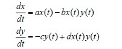
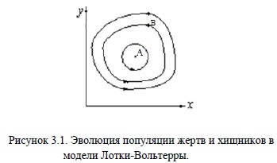
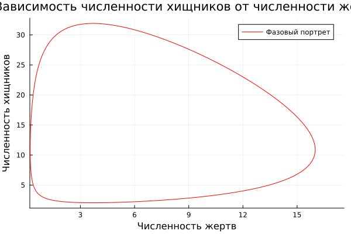
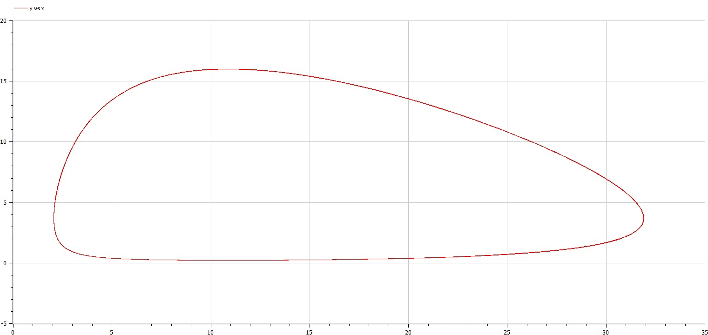
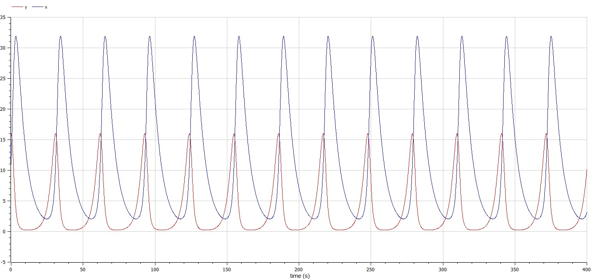

---
## Front matter
title: "Отчёт по лабораторной работе №5"
subtitle: "Математическое моделирование"
author: "Вишняков Александр"

## Generic otions
lang: ru-RU
toc-title: "Содержание"

## Bibliography
bibliography: bib/cite.bib
csl: pandoc/csl/gost-r-7-0-5-2008-numeric.csl

## Pdf output format
toc: true # Table of contents
toc-depth: 2
lof: true # List of figures
lot: true # List of tables
fontsize: 12pt
linestretch: 1.5
papersize: a4
documentclass: scrreprt
## I18n polyglossia
polyglossia-lang:
  name: russian
  options:
  - spelling=modern
  - babelshorthands=true
polyglossia-otherlangs:
  name: english
## I18n babel
babel-lang: russian
babel-otherlangs: english
## Fonts
mainfont: PT Serif
romanfont: PT Serif
sansfont: PT Sans
monofont: PT Mono
mainfontoptions: Ligatures=TeX
romanfontoptions: Ligatures=TeX
sansfontoptions: Ligatures=TeX,Scale=MatchLowercase
monofontoptions: Scale=MatchLowercase,Scale=0.9
## Biblatex
biblatex: true
biblio-style: "gost-numeric"
biblatexoptions:
  - parentracker=true
  - backend=biber
  - hyperref=auto
  - language=auto
  - autolang=other*
  - citestyle=gost-numeric
## Pandoc-crossref LaTeX customization
figureTitle: "Рис."
tableTitle: "Таблица"
listingTitle: "Листинг"
lofTitle: "Список иллюстраций"
lotTitle: "Список таблиц"
lolTitle: "Листинги"
## Misc options
indent: true
header-includes:
  - \usepackage{indentfirst}
  - \usepackage{float} # keep figures where there are in the text
  - \floatplacement{figure}{H} # keep figures where there are in the text
---

# Цель работы

- Познакомиться с простейшей моделью взаимодействия двух видов типа «хищник-жертва»
- Визуализация модели на языках Julia и OpenModelica

# Задание

- Построить график зависимости численности хищников от численности жертв
- Построить графики изменения численности хищников и численности жертв при заданных начальных условиях
- Найти стационарное состояние системы

# Теоретическое введение

****Модель хищник-жертва****

Простейшая модель взаимодействия двух видов типа «хищник — жертва» - модель Лотки-Вольтерры. Данная двувидовая модель основывается
на следующих предположениях:

* Численность популяции жертв x и хищников y зависят только от времени (модель не учитывает пространственное распределение популяции на
занимаемой территории)
* В отсутствии взаимодействия численность видов изменяется по модели Мальтуса, при этом число жертв увеличивается, а число хищников
падает
* Естественная смертность жертвы и естественная рождаемость хищника считаются несущественными
* Эффект насыщения численности обеих популяций не учитывается
* Скорость роста численности жертв уменьшается пропорционально численности хищников



В этой модели *x* – число жертв, *y* - число хищников. Коэффициент a описывает скорость естественного прироста числа жертв в отсутствие
хищников, *с* - естественное вымирание хищников, лишенных пищи в виде жертв. Вероятность взаимодействия жертвы и хищника считается
пропорциональной как количеству жертв, так и числу самих хищников (*xy*). Каждый акт взаимодействия уменьшает популяцию жертв,
но способствует увеличению популяции хищников (члены *-bxy* и *dxy* в правой части уравнения).



Математический анализ этой (жесткой) модели показывает, что имеется стационарное состояние (A на рис. 3.1), всякое же другое начальное
состояние (B) приводит к периодическому колебанию численности как жертв, так и хищников, так что по прошествии некоторого времени
система возвращается в состояние B.

# Выполнение лабораторной работы

По заданной системе пишем программу. В данном случае *x* - численность хищников, а *y* - численность жертв.

```
using Plots
using DifferentialEquations

const x0 = 11
const y0 = 16
const c = 0.17
const d = 0.046
const a = 0.37
const b = 0.034

T = (0, 400)

u0 = [x0, y0]

p = (a, b, c, d)

function F(du, u, p, t)
    a, b, c, d = p
    du[1] = -c*u[1]+d*u[1]*u[2]
    du[2] = a*u[2]-b*u[1]*u[2]
end

prob1 = ODEProblem(F, u0, T, p)
sol1 = solve(prob1, dtmax=0.1)

plt = plot(sol1, vars=(2,1), color=:red, label="Фазовый портрет", title="Зависимость численности хищников от численности жертв", xlabel="Численность жертв", ylabel="Численность хищников")
plt2 = plot(sol1, vars=(0,1), color=:blue, label="Численность хищников", title="Изменение численности хищников и жертв", xlabel="t")
plot!(plt2, sol1, vars=(0,2), color=:green, label="Численность жертв")

savefig(plt, "Julia1.png")
savefig(plt2, "Julia2.png")

```

Получаем график зависимости численности хищников от численности жертв и графики изменения численности хищников и численности жертв.




Теперь напишем программу для нашего уравнения на *OpenModelica*.

```
model Lab5
parameter Integer x0 = 11;
parameter Integer y0 = 16;
parameter Real a = 0.37;
parameter Real b = 0.034;
parameter Real c = 0.17;
parameter Real d = 0.046;
Real x(start=x0);
Real y(start=y0);

equation
der(x) = -c*x+d*x*y;
der(y) = a*y-b*x*y;
end Lab5;
```
Получаем график зависимости числа хищников от числа жертв и графики изменения числа хищников и числа жертв.





# Вывод

Благодаря данной лабораторной работе познакомился с простейшей моделью взаимодействия двух видов типа "хищник-жертва" - моделью
Лотки-Вольтерры, а именно научился:

* строить модель "хищник-жертва"
* строить фазовые портреты системы "хищник-жертва"
* находить стационарное состояние системы "хищник-жертва"* 