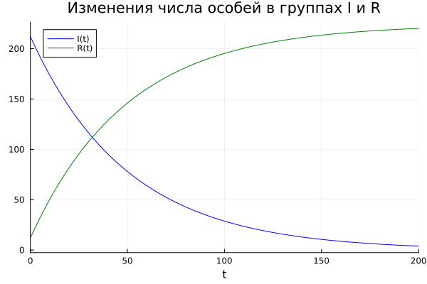

---
## Front matter
lang: ru-RU
title: Лабораторная работа №6
subtitle: Математическое моделирование
author:
  - Вишняков А.
institute:
  - Российский университет дружбы народов, Москва, Россия
date: 15 апреля 2024

## i18n babel
babel-lang: russian
babel-otherlangs: english

## Formatting pdf
toc: false
toc-title: Содержание
slide_level: 2
aspectratio: 169
section-titles: true
theme: metropolis
header-includes:
 - \metroset{progressbar=frametitle,sectionpage=progressbar,numbering=fraction}
 - '\makeatletter'
 - '\beamer@ignorenonframefalse'
 - '\makeatother'
---

# Информация

## Докладчик


  - Вишняков Александр
  - студент 3 курса группы НКНбд-01-21
  -  Российский университет дружбы народов
  -  [GitHub](<https://github.com/sanchess02>)


# Вводная часть

## Объект и предмет исследования

- Модель эпидемии
- Язык программирования Julia
- Система моделирования Openmodelica

## Цели и задачи

- Рассмотреть простейшую модель эпидемии.
- Построить модель и визуализировать график изменения числа особей.
- Визуализировать модель с помощью Julia и OpenModelica.

## Материалы и методы

- Язык программирования Julia
- Пакеты "Plots", "DifferentialEquations"
- OpenModelica

 ## Теоретическая справка
 
 ****Модель эпидемии****

Предположим, что некая популяция, состоящая из N особей, (считаем, что популяция изолирована) подразделяется на три группы.

- S(t) — восприимчивые к болезни, но пока здоровые особи
- I(t) — это число инфицированных особей, которые также при этом являются распространителями инфекции
- R(t) — это здоровые особи с иммунитетом к болезни.

До того, как число заболевших не превышает критического значения I считаем, что все больные изолированы и не заражают здоровых. Когда I(t)>I*, тогда инфицирование способны заражать восприимчивых к болезни особей.

Таким образом, скорость изменения числа S(t) меняется по следующему закону:
$$
 \frac{\partial S}{\partial t} = \begin{cases} - \alpha S, если \ I(t)>I^* \\ 0, если \ I(t) \leq I^* \end{cases}
$$
Поскольку каждая восприимчивая к болезни особь, которая, в конце концов, заболевает, сама становится инфекционной, то скорость изменения числа инфекционных особей представляет разность за единицу времени между заразившимися и теми, кто уже болеет и лечится, т.е.:
$$
 \frac{\partial I}{\partial t} = \begin{cases} \alpha S - \beta I, если \ I(t)>I^* \\  - \beta I, если \ I(t) \leq I^* \end{cases}
$$
А скорость изменения выздоравливающих особей (при этом приобретающие иммунитет к болезни)
$$
\frac{\partial R}{\partial t} = \beta I
$$
Постоянные пропорциональности:

- $$
  \alpha
  $$

   — коэффициент заболеваемости

- $$
  \beta
  $$

  — коэффициент выздоровления

Для того, чтобы решения соответствующих уравнений определялось однозначно, необходимо задать начальные условия. Считаем, что на начало эпидемии в момент времени t = 0 нет особей с иммунитетом к болезни R(0)=0, а число инфицированных и восприимчивых к болезни особей I(0) и S(0) соответственно. Для анализа картины протекания эпидемии необходимо рассмотреть два случая: I(0) > I* и I(0) <= I*


# Содержание лабораторной работы


## Постановка задачи


# Решение программными средствами

**Код на *OpenVodelica***

   ```
model lab06
constant Real a = 0.01; //коэф заболеваемости
constant Real b = 0.02; //коэф выздоровления
constant Real N = 12000; //общее число популяции


Real R; // здоровые, с иммунитетом
Real I; // заболевшие
Real S; // здоровые, в зоне риска

initial equation
R = 12;
I = 212; //кол-во заболевших в t = 0
S = N-I-R;

equation
//Случай 1: I>I*

der(S) = - a * S;
der(I) = a * S-b * I;
der(R) = b * I; 


//Случай 2: I<=I*

/*
der(S) = 0;
der(I) = -b * I;
der(R) = b * I; 
*/

end lab06;
   ```
  
Результат 1 случая(I > I):


Результат 2 случая(I <= I):


**Код на *Julia***

   ```
using Plots
using DifferentialEquations

const N = 12000
const I0 = 212
const R0 = 12

const alpha = 0.01 
const beta = 0.02

S0 = N - I0 - R0

T = (0, 200)

u0 = [S0, I0, R0]

p1 = (beta)

# I0 < I*

function F1(du, u, p, t)
    beta = p
    du[1] = 0
    du[2] = -beta*u[2]
    du[3] = beta*u[2]
end

prob1 = ODEProblem(F1, u0, T, p1)
sol1 = solve(prob1, dtmax=0.01)

plt = plot(sol1, vars=(0,1), color=:red, label="S(t)", title="Изменения числа особей в группе S", xlabel="t")
plt2 = plot(sol1, vars=(0,2), color=:blue, label="I(t)", title="Изменения числа особей в группах I и R", xlabel="t")
plot!(plt2, sol1, vars=(0,3), color=:green, label="R(t)")

savefig(plt, "Julia11.png")
savefig(plt2, "Julia12.png")

# I0 > I*

p2 = (alpha, beta)

function F2(du, u, p, t)
    alpha, beta = p
    du[1] = -alpha*u[1]
    du[2] = alpha*u[1]-beta*u[2]
    du[3] = beta*u[2]
end

prob2 = ODEProblem(F2, u0, T, p2)
sol2 = solve(prob2, dtmax=0.01)

plt = plot(sol2, vars=(0,1), color=:red, label="S(t)", title="Изменения числа особей в группах", xlabel="t")
plot!(plt, sol2, vars=(0,2), color=:blue, label="I(t)")
plot!(plt, sol2, vars=(0,3), color=:green, label="R(t)")

savefig(plt, "Julia2.png")

   ```
Результаты сохраняем в два графика, чтобы можно было увидеть изменения в группах R и I. Так как все инфицированные изолированы, количество особей в группе S не изменяется, число особей в группе I уменьшается, а в группе R - растет.




Получаем графики изменения численности особей для групп S, I, R. Численность в группе R увеличивается, в группе I сначала растет, потом начинает уменьшаться, а в группе S уменьшается, то есть особи из группы S сначала переходят в группу I, а затем в группу R.


# Вывод

Благодаря данной лабораторной работе познакомился с простейшей моделью эпидемии.