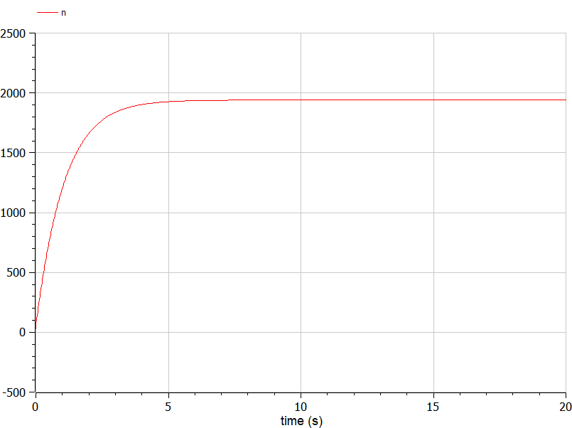
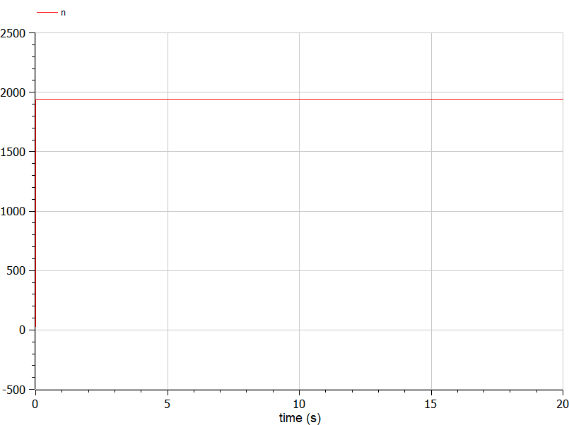
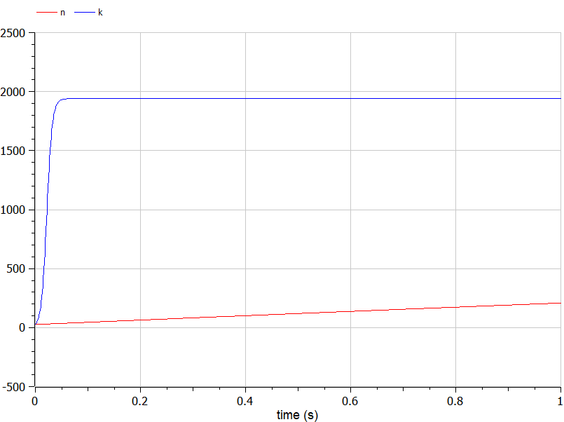
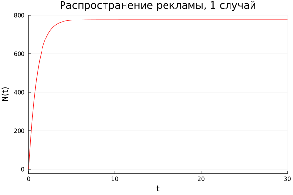
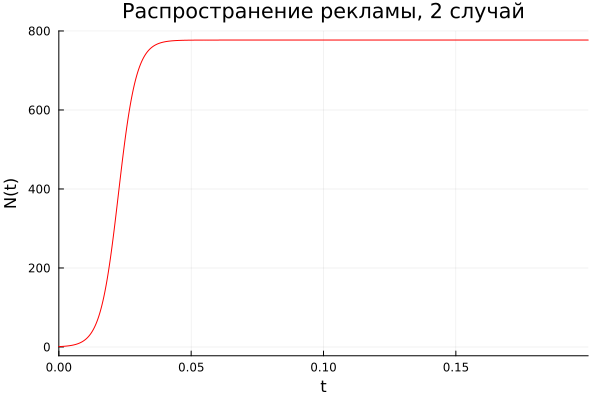
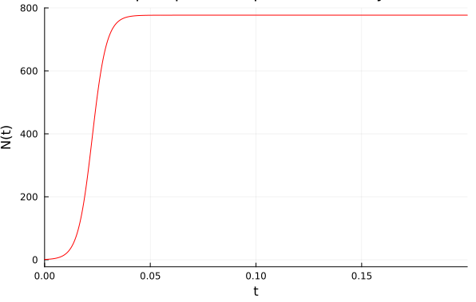

---
## Front matter
lang: ru-RU
title: Лабораторная работа №7
subtitle: Математическое моделирование
author:
  - Вишняков А.
institute:
  - Российский университет дружбы народов, Москва, Россия
date: 17 апреля 2024

## i18n babel
babel-lang: russian
babel-otherlangs: english

## Formatting pdf
toc: false
toc-title: Содержание
slide_level: 2
aspectratio: 169
section-titles: true
theme: metropolis
header-includes:
 - \metroset{progressbar=frametitle,sectionpage=progressbar,numbering=fraction}
 - '\makeatletter'
 - '\beamer@ignorenonframefalse'
 - '\makeatother'
---

# Информация

## Докладчик


  - Вишняков Александр
  - студент 3 курса группы НКНбд-01-21
  -  Российский университет дружбы народов
  -  [GitHub](<https://github.com/sanchess02>)


# Вводная часть

## Объект и предмет исследования

- Модель "Эффективность рекламы"
- Язык программирования Julia
- Система моделирования Openmodelica

## Цели и задачи

- Рассмотреть простейшую модель "эффективность рекламы".
- Построить модель и визуализировать и анализировать графики эффективности распространения рекламы для трех случаев.
- Визуализировать модель с помощью Julia и OpenModelica

## Материалы и методы

- Язык программирования Julia
- Пакеты "Plots", "DifferentialEquations"
- OpenModelica

 ## Теоретическая справка
 
 ****Модель "эффективность рекламы"****

Организуется рекламная кампания нового товара или услуги. Необходимо, чтобы прибыль будущих продаж с избытком покрывала издержки на рекламу. Вначале расходы могут превышать прибыль, поскольку лишь малая часть потенциальных покупателей будет информирована о новинке. Затем, при увеличении числа продаж, возрастает и прибыль, и, наконец, наступит момент, когда рынок насытится, и рекламировать товар станет бесполезным.

Предположим, что торговыми учреждениями реализуется некоторая продукция, о которой в момент времени $t$ из числа потенциальных покупателей $N$ знает лишь $n$ покупателей. Для ускорения сбыта продукции запускается реклама по радио, телевидению и других средств массовой информации. После запуска рекламной кампании информация о продукции начнет распространяться среди потенциальных покупателей путем общения друг с другом. Таким образом, после запуска рекламных объявлений скорость изменения числа знающих о продукции людей пропорциональна как числу знающих о товаре покупателей, так и числу покупателей о нем не знающих.

Модель рекламной кампании описывается следующими величинами. Считаем, что
$$
\frac{\partial n}{\partial t}
$$
— скорость изменения со временем числа потребителей, узнавших о товаре и готовых его купить;

t — время, прошедшее с начала рекламной кампании;

n(t)— число уже информированных клиентов. Эта величина пропорциональна числу покупателей, еще не знающих о нем. Это описывается следующим образом:
$$
\alpha_1(t)(N-n(t)) 
$$
N — общее число потенциальных платежеспособных покупателей;
$$
\alpha_1(t)>0
$$
 — характеризует интенсивность рекламной кампании (зависит от затрат на рекламу в данный момент времени).

Помимо этого, узнавшие о товаре потребители также распространяют полученную информацию среди потенциальных покупателей, не знающих о нем (в этом случае работает т.н. сарафанное радио). Этот вклад в рекламу описывается величиной
$$
\alpha_2(t)n(t)(N-n(t))
$$
эта величина увеличивается с увеличением потребителей узнавших о товаре.

Математическая модель распространения рекламы описывается уравнением:
$$
\frac{\partial n}{\partial t} = (\alpha_1(t) + \alpha_2(t)n(t))(N - n(t))
$$

# Содержание лабораторной работы


## Постановка задачи

Вариант 6.

Постройте график распространения рекламы, математическая модель которой описывается
следующим уравнением:

1) dn/dt = (0.99 + 0.00012 *n(t)) * (N-n(t))
2) dn/dt = (0.000067 + 0.38 *n(t)) * (N-n(t))
3) dn/dt = (0.6 *sin(4t) + 0.1 *cosn(2t) *n(t)) * (N-n(t))

При этом объем аудитории N = 777 , в начальный момент о товаре знает 1 человек. Для
случая 2 определите в какой момент времени скорость распространения рекламы будет
иметь максимальное значение.

# Решение программными средствами

**Код на *OpenModelica***

   ```
model Lab07
parameter Real N = 777;
parameter Real N0 = 1;
Real n(start=N0);
equation
// 1 случай
der(n) = (0.99 + 0.00012 *n) * (N-n);
// 2 случай
//der(n) = (0.000067 + 0.38 *n) * (N-n);
// 3 случай
//der(n) = (0.6 *sin(4t) + 0.1 *cosn(2t) *n) * (N-n);
end Lab07;
   ```
  
Результат 1 случая:



Результат 2 случая:


Результат 3 случая:



Сравнение эффективности сарафанного радио и платной рекламы:



**Код на *Julia***

   ```
using Plots
using DifferentialEquations

const N = 777
const N0 = 1

T1 = (0, 30)

T2 = (0, 0.2)

u0 = [N0]

# 1 случай (alpha1 >> alpha2)

function F1(du, u, p, t)
     du[1] = (0.99 + 0.00012*u[1])*(N - u[1])
end

prob1 = ODEProblem(F1, u0, T1)
sol1 = solve(prob1, dtmax=0.1)

plt1 = plot(sol1, color=:red, title="Распространение рекламы, 1 случай", legend=false, xlabel="t", ylabel="N(t)")

savefig(plt1, "Julia1.png")

# 2 случай (alpha1 << alpha2)

maxx = [-10000.0, 0]

function F2(du, u, p, t)
    du[1] = (0.000067 + 0.38*u[1])*(N - u[1])

    if du[1] > maxx[1]
        maxx[1] = du[1]
        maxx[2] = t
    end
end

prob2 = ODEProblem(F2, u0, T2)
sol2 = solve(prob2, dtmax=0.001)

println("t = ", maxx[2])

plt2 = plot(sol2, color=:red, title="Распространение рекламы, 2 случай", legend=false, xlabel="t", ylabel="N(t)")

savefig(plt2, "Julia2.png")

# 3 случай (alpha1, alpha2 - периодические функции)

function F3(du, u, p, t)
    du[1] = (0.6*sin(4*t) + 0.1*cos(2*t)*u[1])*(N - u[1])
end

prob3 = ODEProblem(F3, u0, T2)
sol3 = solve(prob3, dtmax=0.001)

plt3 = plot(sol3, color=:red, title="Распространение рекламы, 3 случай", legend=false, xlabel="t", ylabel="N(t)")

savefig(plt3, "Julia3.png")


   ```
Рассмотрим первый случай, где alpha1 > alpha 2, и напишем программу. В функции F1 опишем, как меняется скорость распространения рекламы.

В результате в виде графика мы видим, что количество осведомленных о товаре клиентов постепенно растет, пока не достигает максимально возможного - N.



Изменим функцию, чтобы она описывала ситуацию, где alpha1 < alpha 2. Добавим в функцию F1 нахождение момента времени, в который скорость распространения рекламы, то есть производная, максимальна.

Получаем график распространения рекламы для второго случая. График принимает вид логистической кривой: сначала численность осведомленных о товаре клиентов растет медленно, но затем начинает увеличиваться быстрее.



Наконец поменяем функцию, чтобы она описывала ситуацию, где alpha1 и alpha 2 - периодические функции.

Получаем график распространения рекламы для третьего случая. График принимает вид, схожий со вторым случаем: численность осведомленных о товаре клиентов сначала возрастает медленно, а затем начинает стремительно увеличиваться.
 


# Вывод

Рассмотрел модель эффективности рекламы в разных случаях. Сравнил решения, учитывающее вклад только платной рекламы и учитывающее вклад только сарафанного радио.