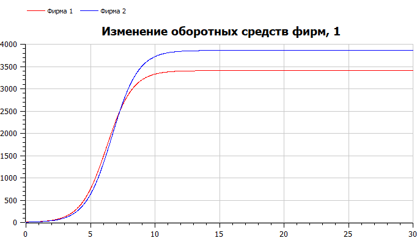
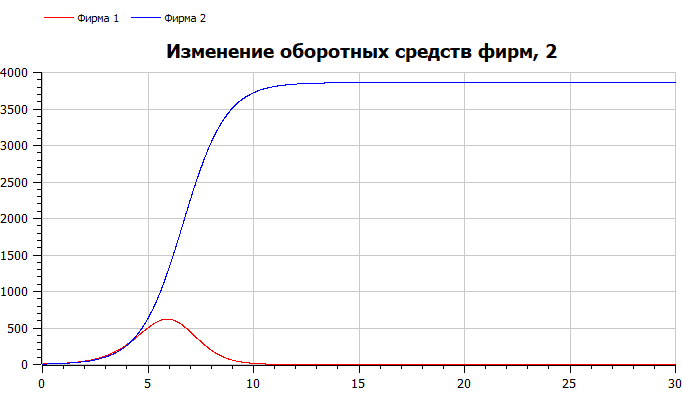
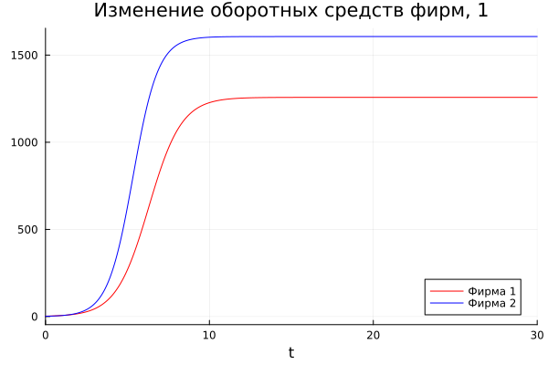
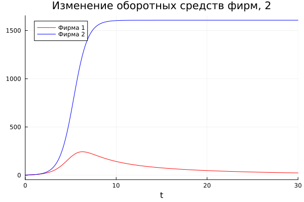

---
## Front matter
title: "Отчёт по лабораторной работе №8"
subtitle: "Математическое моделирование"
author: "Вишняков Александр"

## Generic otions
lang: ru-RU
toc-title: "Содержание"

## Bibliography
bibliography: bib/cite.bib
csl: pandoc/csl/gost-r-7-0-5-2008-numeric.csl

## Pdf output format
toc: true # Table of contents
toc-depth: 2
lof: true # List of figures
lot: true # List of tables
fontsize: 12pt
linestretch: 1.5
papersize: a4
documentclass: scrreprt
## I18n polyglossia
polyglossia-lang:
  name: russian
  options:
  - spelling=modern
  - babelshorthands=true
polyglossia-otherlangs:
  name: english
## I18n babel
babel-lang: russian
babel-otherlangs: english
## Fonts
mainfont: PT Serif
romanfont: PT Serif
sansfont: PT Sans
monofont: PT Mono
mainfontoptions: Ligatures=TeX
romanfontoptions: Ligatures=TeX
sansfontoptions: Ligatures=TeX,Scale=MatchLowercase
monofontoptions: Scale=MatchLowercase,Scale=0.9
## Biblatex
biblatex: true
biblio-style: "gost-numeric"
biblatexoptions:
  - parentracker=true
  - backend=biber
  - hyperref=auto
  - language=auto
  - autolang=other*
  - citestyle=gost-numeric
## Pandoc-crossref LaTeX customization
figureTitle: "Рис."
tableTitle: "Таблица"
listingTitle: "Листинг"
lofTitle: "Список иллюстраций"
lotTitle: "Список таблиц"
lolTitle: "Листинги"
## Misc options
indent: true
header-includes:
  - \usepackage{indentfirst}
  - \usepackage{float} # keep figures where there are in the text
  - \floatplacement{figure}{H} # keep figures where there are in the text
---

# Цель работы

- Познакомиться с моделью конкуренции двух фирм
- Визуализировать модель с помощью Julia и OpenModelica

# Задание

Вариант 6.

- Построить графики изменения оборотных средств двух фирм
- Рассмотреть два случая: где борьба ведется только рыночными методами и где учитываются социально-психологические факторы

# Выполнение лабораторной работы

**Код на *OpenModelica***

   ```
model Lab08
constant Real M0_1 = 2.3;
constant Real M0_2 = 1.6;
constant Real p_cr = 18;
constant Real N = 21;
constant Real q = 1;
constant Real tau1 = 14;
constant Real tau2 = 17;
constant Real p1 = 11;
constant Real p2 = 9;
parameter Real a1 = p_cr/(tau1^2*p1^2*N*q);
parameter Real a2 = p_cr/(tau2^2*p2^2*N*q);
parameter Real b = p_cr/(tau1^2*tau2^2*p1^2*p2^2*N*q);
parameter Real c1 = (p_cr - p1)/(tau1*p1);
parameter Real c2 = (p_cr - p2)/(tau2*p2);
Real M1(start=M0_1);
Real M2(start=M0_2);
equation
der(M1) = M1 - b/c1*M1*M2 - a1/c1*M1^2;
der(M2) = c2/c1*M2 - b/c1*M1*M2 - a2/c1*M2^2;
//der(M1) = M1 - (b/c1 + 0.00065)*M1*M2 - a1/c1*M1^2;
end Lab08;

   ```
  
Результат 1 случая: Получаем график изменения оборотных средств для двух фирм.



Результат 2 случая: Получаем график динамики изменения объемов продаж для двух фирм.




**Код на *Julia***

   ```
using Plots
using DifferentialEquations

const M0_1 = 2.3
const M0_2 = 1.6
const p_cr = 18
const N = 21
const q = 1
const tau1 = 14
const tau2 = 17
const p1 = 11
const p2 = 9

a1 = p_cr/(tau1^2*p1^2*N*q)
a2 = p_cr/(tau2^2*p2^2*N*q)
b = p_cr/(tau1^2*tau2^2*p1^2*p2^2*N*q)
c1 = (p_cr - p1)/(tau1*p1)
c2 = (p_cr - p2)/(tau2*p2)

T = (0, 30)

u0 = [M0_1, M0_2]

# 1 случай

function F1(du, u, p, t)
    du[1] = u[1] - b/c1*u[1]*u[2] - a1/c1*u[1]^2
    du[2] = c2/c1*u[2] - b/c1*u[1]*u[2] - a2/c1*u[2]^2
end

prob1 = ODEProblem(F1, u0, T)
sol1 = solve(prob1, dtmax=0.01)

plt1 = plot(sol1, vars=(0, 1), color=:red, title="Изменение оборотных средств фирм, 1", legend=true, label="Фирма 1")
plot!(plt1, sol1, vars=(0, 2), color=:blue, label="Фирма 2")

savefig(plt1, "Julia1.png")

# 2 случай

function F2(du, u, p, t)
    du[1] = u[1] - (b/c1 + 0.00065)*u[1]*u[2] - a1/c1*u[1]^2
    du[2] = c2/c1*u[2] - b/c1*u[1]*u[2] - a2/c1*u[2]^2
end

prob2 = ODEProblem(F2, u0, T)
sol2 = solve(prob2, dtmax=0.01)

plt2 = plot(sol2, vars=(0, 1), color=:red, title="Изменение оборотных средств фирм, 2", legend=true, label="Фирма 1")
plot!(plt2, sol2, vars=(0, 2), color=:blue, label="Фирма 2")

savefig(plt2, "Julia2.png")

   ```

Случай 1:

Результаты сохраняем в виде графика. 



Случай 2: 

Получаем график динамики изменения объемов продаж для второго случая. По графику видно, что первая фирма, несмотря на начальный рост, достигнув своего максимального объема продаж, начитает нести убытки и, в итоге, терпит банкротство. 
Динамика роста объемов оборотных средств второй фирмы остается без изменения: достигнув максимального значения, остается на этом уровне.



# Вывод

В ходе работы мы изучили модель конкуренции двух фирм и применили навыки работы с Julia и OpenModelica для построения графиков, визуализирующих эту модель. Результатом работы стали графики динамики изменения объемов продаж для двух случаев.